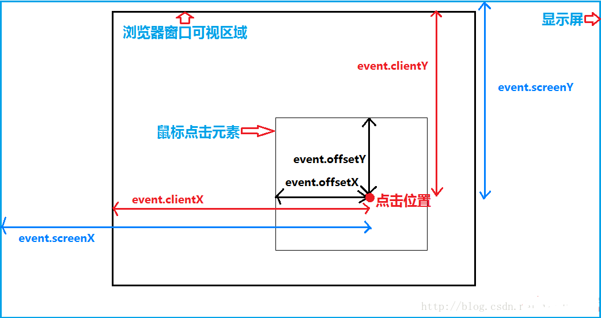

# drag.js
### 自己封装的第一个组件，主要是为了练习自己组件化的能力
### 原生js实现的js拖拽事件
### 使用时，直接创建对象即可
```javascript
window.onload = function() {
    var drag = new Drag('img');
};
```
[demo](demo.html)<br>
[drag.js](drag.js)
### 附：screen,client,offset的差别

